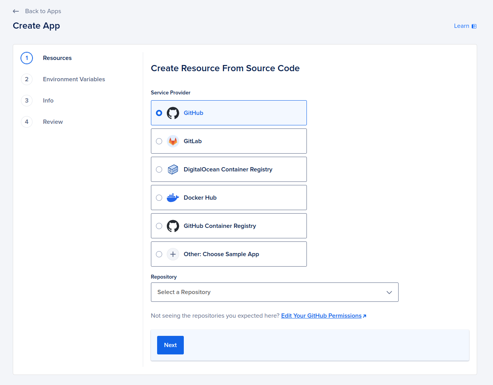
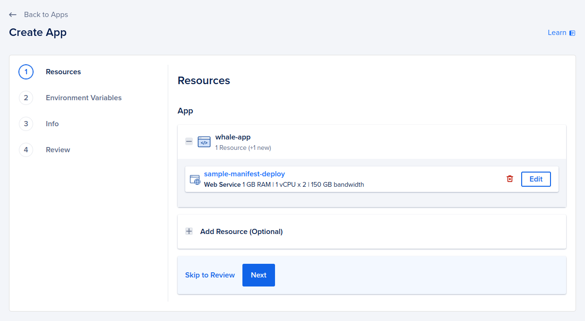
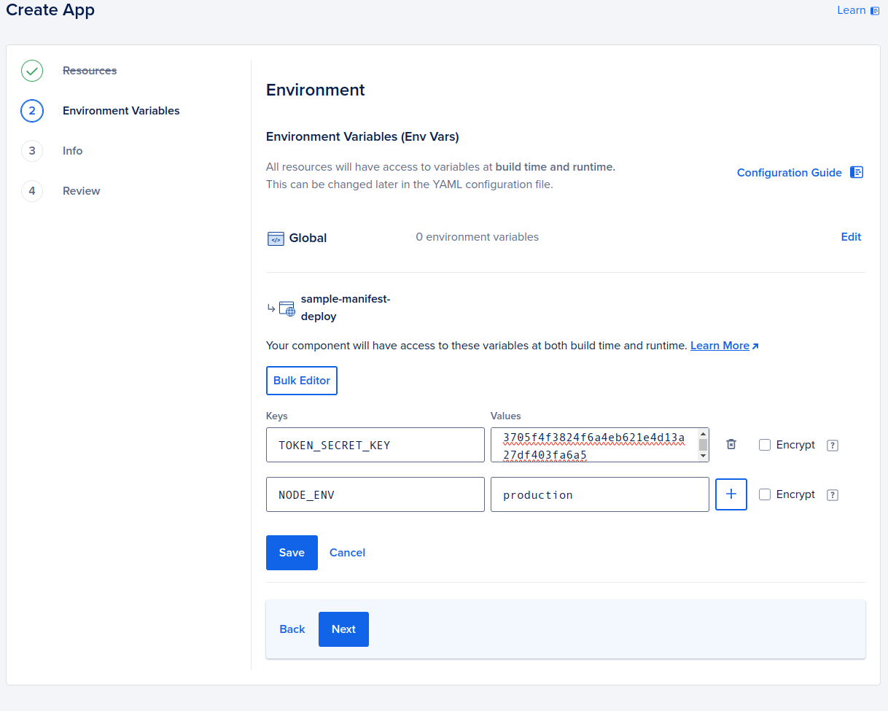

# Deploy Manifest on DigitalOcean

[DigitalOcean](https://www.digitalocean.com/) is a popular hosting provider that delivers a high quality service. This guide shows how to deploy Manifest using DigitalOcean App Platform, a service to deploy apps with very few infrastructure configuration.

First, log in on create an account on DigitalOcean. Then click on the "Create" button on the top menu, and select "App Platform" in the dropdown menu.

## Link the source provider

In our example we are deploying a Manifest backend hosted in [GitHub](https://github.com/) but you can get it from other sources too like GitLab or Docker Hub ([see Docker config here](./deploy.md#docker)).

Select your repository and branch and leave the "source directory" as it is. Leave the "autodeploy" checkbox checked if you want to allow push-to-deploy on your main branch. Click on "Next".

## Configure the app

You should see your app recognized as "web service", click on the "edit" button to go into the configuration.

Here are the points you can edit (in page order)

- **Resource size (optional)**: Manifest can run on the cheapest instance (5$) on small/medium projects. By default Digital Ocean chooses a bigger one, change it to save some money.
- **Run command**: Replace the default run command by `node node_modules/manifest/dist/manifest/src/main.js`
- **Public HTTP Port:** Change it to `1111` to match Manifest's default port.

Then you can click on "Next".

### Set environment variables

Click on your app name's "Edit" button and add the 2 environment variables: `TOKEN_SECRET_KEY` (you can generate one with [JWTSecret.com](https://jwtsecret.com/generate)) and `NODE_ENV=production`.

### Deploy

The last step let's you choose your app name and region where you should select the location that is closest to your users. After the recap you are good to go. Click on "Create resources" to launch the build.

🎉 That's it! You can click on the "Live App" button to see it live. To set up your own domain name, add it to the "Domains" setting.
