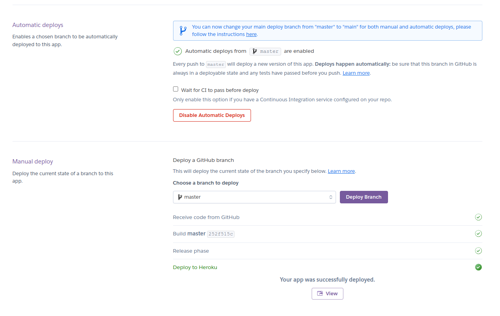

# Deploy Manifest on Heroku

[Heroku](https://heroku.com/) is a popular cloud app platform provider that supports many languages and provides a nice interface to deploy apps.

### Create a "start" script for production

The `npm run manifest` script should only be used for **development** as it watches file changes.

Go back to your codebase and open the `package.json` file and add a new **start** script on the scripts list with the value `node node_modules/manifest/dist/manifest/src/main.js` as following:

```json title="package.json"
"scripts": {
    "start": "node node_modules/manifest/dist/manifest/src/main.js"
    [...]
}
```

## Link the source provider

Sign in to your [Heroku](https://heroku.com/) account or create a new one.

You can click on the "New" button and then "Create a new app" to get started. Choose the app name and the region that is closest to your users and click on "Create app".

In our example we are deploying a Manifest backend hosted in [GitHub](https://github.com) but you can get it from other sources too like Heroku Git or Container Registry.

Select "GitHub" and then connect the repository of your manifest backend. Click on "Automatic deploys" if you want to enable push-to-deploy on the main branch. Make sure that you are on the correct branch that corresponds to your production version (usually `main` or `master`).



Click on "Deploy branch" to build your app.

:::warning

A message will indicate that your app is ready, and a link to view it will appear. However, we still have some configuration to make it work.

:::

## Add environment variables

Go to the "Settings" tab and click on "Reveal Config Vars" in the "Config Vars" section. Then add the 2 environment variables: `TOKEN_SECRET_KEY` (which you can generate at https://jwtsecret.com/generate) and `NODE_ENV=production`.

🎉 That's it! Now you can click on "Open app" to see it!
